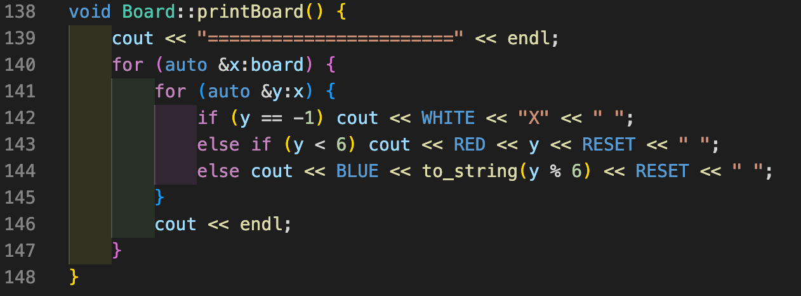
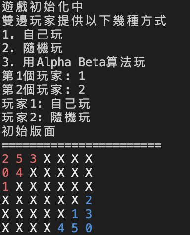
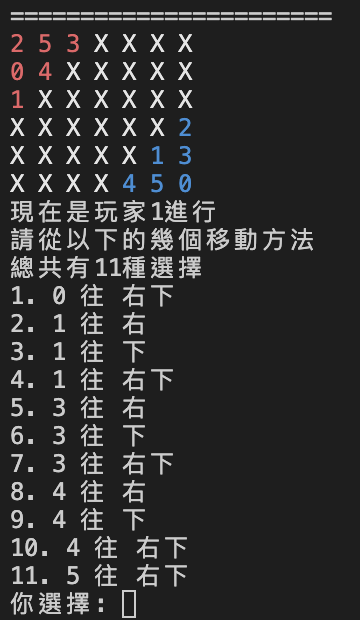
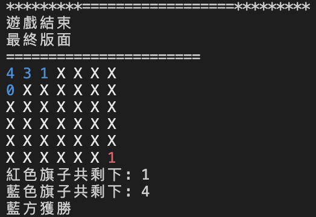

# Modified_6×7_EinStein_Würfelt_Nicht

## 編譯
### 使用g++指令進行編譯
1. 進入與main.cpp相同層級的資料夾(也就是根資料夾)
2. 輸入以下指令
    ```
    g++ main.cpp ./Board/board.cpp ./Game/game.cpp ./Player/PlayerBase/playerBase.cpp ./Player/PlayerHuman/playerHuman.cpp ./Player/PlayerRandom/playerRandom.cpp ./Player/PlayerAlphaBeta/playerAlphaBeta.cpp ./Player/PlayerPVS/playerPVS.cpp --std=c++17 -o a.out
    ```
3. 會看到在當前目錄下多了a.out檔案
4. 直接執行a.out即可

### 使用CMake進行編譯
1. 進入與main.cpp相同層級的資料夾(也就是根資料夾)
2. 創建一個build資料夾
    - mkdir build
3. 進入build資料夾
    - cd build
4. 輸入以下指令
    - cmake ..
    - make
5. 此時在build資料夾下會多出EinStein的執行檔
6. 直接執行EinStein檔案即可

## Note
1. 由於撰寫時是在mac上進行的，並且在輸出版面時有使用到顏色的更改，如果是在windows上執行發生無法正確印出版面時請修改一下地方
    - ./Board/board.cpp 中的 142~144行，將[`WHITE`, `RED`, `RESET`]移除
    - 
    - 當移除後就不會有文字顏色，會導致無法分清楚我方旗子或是敵方，所以還是推薦在可以正常顯示的電腦上跑

## 架構說明
### Game
遊戲主體，會在一開始的時候創建版面同時開始遊戲流程

### Board
控制棋盤，所有與棋盤相關的資訊與功能皆放在此
- 合法走步
- 移動
- 是否結束
- 等等...

### Player
玩家相關方法，由PlayerBase作為基底，其他的玩家類型皆繼承自PlayerBase
總共分為以下4種玩家
1. Human Player
- 由真人選擇要移動的方法

2. Random Player
- 從可移動的選項中隨機選擇

3. Alpha-Beta Player
- 使用alpha-beta的演算法來決定要怎麼移動

4. PVS Player
- 使用PVS的演算法來決定要怎麼移動
- 使用PVS與使用Alpha-Beta演算法得出的結果會相同，但是執行效率會比較高
    - 經過測試平均會提升16%的速度

## 簡單的遊戲介面
1. 初始畫面
- 
2. 真人玩家
- 
3. 結束畫面
- 
